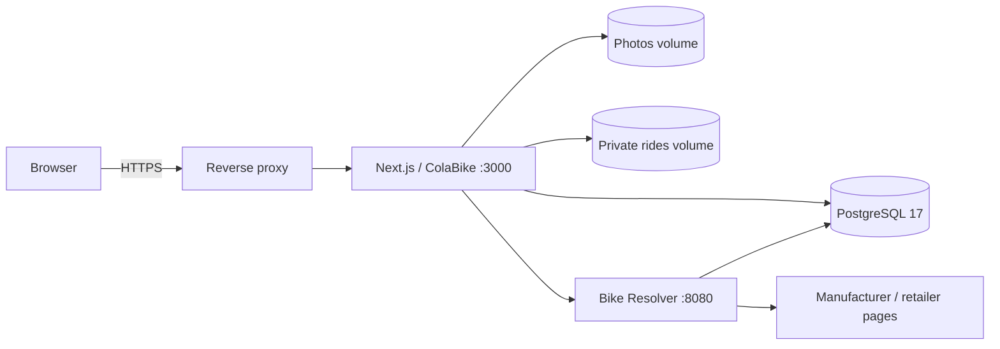

# ColaBike

**Сообщество вокруг велосипедов: собирайте байк, показывайте сборку, делитесь опытом и покатушками.**

[](https://github.com/grayhex/cola/actions/workflows/check.yml)

ColaBike объединяет личный гараж, публичные профили, журнал, статьи, GPX-покатушки, барахолку, достижения и поиск заводской комплектации. Велосипед — центральный объект: заводской снимок хранится отдельно от текущих компонентов, а записи и поездки связаны с конкретным байком.

[Документация](docs/README.md) · [Разработка](CONTRIBUTING.md) · [Production](docs/operations/deployment.md) · [Backup/restore](docs/operations/backup-restore.md)

## Возможности

### Велосипеды, классификация и Resolver

Главная показывает события сообщества и популярные сборки; полная витрина находится на `/bikes`. В гараже доступны фотографии с выбором обложки, компоненты и аксессуары, вес, размер, пробег, стоимость, история сборки и управление публичностью. Цена раскрывается только по выбору владельца.

[Классификация](docs/modules/bike-classification.md) разделяет Category, Subtype, Suspension, Construction, до трёх назначений Use и признаки Electric/Fatbike. Электропривод, складная конструкция и широкие покрышки не заменяют основную категорию. Формы и поиск используют независимые признаки; карточка показывает лишь 2–3 информативных лейбла. Миграция `020_bike_classification` сохраняет старые данные.

Трёхшаговый мастер принимает свободное название модели, комплектацию и известный год, предлагает автоматический поиск, повтор, разбор пользовательской ссылки и ручное заполнение. Классификация и год уточняются перед сохранением; неизвестный год не подменяется выдуманным. Мастер открывается и из кабинета, закрывается по явному действию, а потеря черновика подтверждается диалогом сайта.

[Bike Resolver](docs/resolver/architecture.md) — отдельный внутренний сервис. Он ищет кандидатов на сайтах производителей и магазинов, разбирает HTML/structured data, показывает прогресс, проверяет совпадение модели/года и возвращает частичный результат для проверки пользователем. Настройки источников, кеш, ограничения запросов и SSRF-защита остаются на сервере. Наличие адаптера и успешный fixture-тест не гарантируют доступность внешнего сайта.

### Журнал, статьи и сообщество

[Журнал](docs/modules/journal.md) поддерживает записи, снимки компонентов, вопросы, ответы и сохранённое. На `/j/new` автор выбирает собственный велосипед; переход из карточки может заполнить его заранее. Подписки на автора и велосипед объединяются без дублей. Читатель может подписываться и сохранять записи без своего байка.

`/articles` — база знаний без обязательной привязки статьи к велосипеду. Общий Tiptap-редактор предоставляет визуальное форматирование, безопасный предпросмотр и Markdown-исходник. Статьи поддерживают черновики, рубрики и до восьми иллюстраций; ссылки на фотографии не дают доступа к чужим файлам. Raw HTML не исполняется.

Профили, реакции, обсуждения, уведомления, жалобы и модерация используют общие правила видимости. Поиск объединяет велосипеды, компоненты и покатушки; расширенный поиск опыта доступен на `/experience`. [Достижения и рекорды](docs/modules/gamification.md) вычисляются по реальным сборкам и активности, а не означают техническую совместимость деталей. [Барахолка](docs/modules/market.md) использует отдельные карточки с ограниченной областью фотографии.

### Покатушки и карты

[Покатушка](docs/modules/rides.md) всегда связана с велосипедом владельца. Трек (GPX, TCX или FIT) обрабатывается сервером: дистанция, продолжительность, скорость, высота и геометрия не принимаются на доверии от браузера. Оригинал остаётся приватным; публичная геометрия и профиль скорости учитывают зоны приватности около старта и финиша. Разрывы трека не соединяются выдуманной линией.

Поддерживаются импорт Garmin CSV и последующее добавление подходящего GPX. Импорт CSV не является автоматической синхронизацией Garmin/Strava. Планы поездок, приглашения, еженедельные серии и RSVP привязаны к соответствующей дате; планы и отменённые поездки не увеличивают пробег.

[Карты](docs/integrations/maps.md): MapLibre/OSM, отдельный renderer Яндекса и резервное отображение. Миниатюры используют OSM. Выбор карты или режима «линия / скрыть» не меняет приватность исходного GPX.

### Администрирование и оформление

Админка управляет регистрацией, пользователями, модерацией, навигацией, текстами, справочниками, Resolver, картами и игровыми механиками. Канонические ключи классификации версионируются вместе со схемой; редактируемая подпись не создаёт новую категорию.

[Дизайн-система](docs/development/ui.md) использует Source Sans 3, встроенные векторные иконки, светлую и тёмную темы. В шапке — переключение в один клик; режим «Система» доступен в профиле. Фон и прозрачность настраиваются отдельно для каждой темы. [Медиатека](docs/integrations/content-artwork.md) обслуживает изображения контента, награды и безопасные SVG-анимации; системные иконки не заменяются загружаемыми растровыми файлами.

## Архитектура



Node.js 24 LTS, Next.js 16, React 19 и PostgreSQL 17 образуют приложение; Resolver использует TypeScript/Fastify/Cheerio/Zod. Sharp обрабатывает фотографии, MapLibre — карты, fast-xml-parser — GPX. Версии и полный граф зависимостей задают package/lock-файлы.

Публичные DTO не раскрывают email и служебные поля. Доступ к велосипеду, записи, поездке и медиа проверяется сервером на каждом чтении. Мутации защищены авторизацией, origin/CSRF-проверками, квотами и ограничениями частоты. Подробности — в [архитектуре безопасности](docs/architecture/security.md).

## Быстрый запуск

Нужны Docker Engine и Docker Compose:

```bash
git clone https://github.com/grayhex/cola.git
cd cola
docker compose up --build -d
```

Приложение доступно на `http://localhost:3000`. Локальная `.env` необязательна; для постоянной установки создайте её из `.env.example` и задайте собственные значения. Данные находятся в volumes `database`, `photos`, `rides`; Resolver и PostgreSQL наружу не публикуются.

Контейнер сначала проверяет runtime-конфигурацию, затем применяет миграции и запускает сервер от непривилегированного пользователя. Новая установка не создаёт демонстрационные профили, велосипеды или GPX. Номер миграции `013` зарезервирован навсегда; уже применённая запись остаётся допустимой и не удаляется из истории. Существующие пользовательские данные этим обновлением не очищаются.

Первый администратор и локальная разработка: [первый запуск](docs/development/getting-started.md). Production требует отдельной конфигурации, HTTPS и проверенного SHA: [развёртывание](docs/operations/deployment.md), [CI/CD](docs/operations/ci-cd.md). Host-side команды backup/restore выполняются из checkout репозитория, не из app-контейнера.

## Проверки и документация

[Тестирование](docs/development/testing.md) охватывает unit/PGlite, Resolver fixtures, настоящий PostgreSQL и конкурентные HTTP-операции, Chromium и mobile WebKit, сборку финальных Docker-образов и восстановление данных. Браузерные проекты имеют раздельные БД и по одному worker. Обязательный `check` требует успеха всех групп.

Изменения проверяются на итоговом дереве PR; результаты предыдущей ветки не заменяют новый прогон. Недоступные проверки указываются явно. Исторические отчёты, промежуточные патчи и скриншоты доступны в истории Git, а в текущем дереве находится только действующее руководство.

[Оглавление всех глав](docs/README.md) · [Данные и миграции](docs/architecture/data-model.md) · [Принципы разработки](docs/development/principles.md) · [Мониторинг](docs/operations/monitoring.md)
