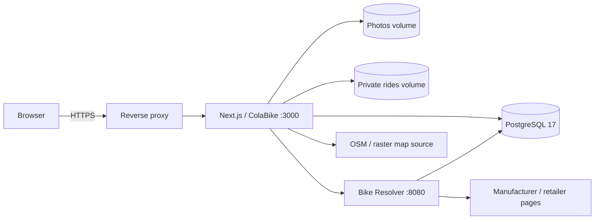

<div align="center">

# ColaBike

**Социальная витрина велосипедов: собирай байк, показывай сборку, делись покатушками и сравнивай прогресс с сообществом.**

[](./package.json)
[](https://nextjs.org/)
[](https://react.dev/)
[](https://www.postgresql.org/)
[](https://docs.docker.com/compose/)
[](https://github.com/grayhex/cola/actions/workflows/check.yml)

</div>

ColaBike объединяет **гараж велосипедов**, публичные профили, социальную ленту, GPX-покатушки, достижения и автоматический поиск заводской комплектации.

Главная идея проста: велосипед — центральный объект профиля. Его можно собрать вручную или через Bike Resolver, оформить фотографиями и характеристиками, публиковать изменения, привязывать реальные поездки и показывать другим участникам.

> Проект находится в активной разработке. Приватность велосипеда и покатушек контролирует владелец.

---

## Возможности

### 🚲 Велосипеды и гараж

- публичная витрина велосипедов с поиском, категориями и сортировкой;
- личный гараж и публичный профиль пользователя;
- заводская и текущая комплектация хранятся отдельно;
- компоненты, аксессуары, вес, размер, пробег, стоимость и описание;
- до 12 фотографий с выбором обложки и серверной обработкой;
- версии сборки и история изменений;
- гибкое отображение карточек и деталей велосипеда;
- приватный или публичный режим для каждого велосипеда.

Страница велосипеда объединяет фотографии, компактную комплектацию, социальную активность и связанные покатушки.

### 🔎 Bike Resolver 2.0

Отдельный сервис `services/bike-resolver` помогает восстановить заводскую комплектацию по бренду, модели, версии и году.

Он умеет:

- искать характеристики на официальных сайтах и поддерживаемых товарных страницах;
- разбирать таблицы, structured data и разные HTML-layouts;
- показывать живой прогресс поиска;
- определять неоднозначные результаты и несовпадение модели/года;
- импортировать комплектацию по ссылке пользователя;
- возвращать частичный результат для ручной проверки;
- искать изображения велосипеда;
- кешировать результаты и ограничивать upstream-запросы;
- защищаться от SSRF, локальных адресов и небезопасных redirect.

Resolver работает как внутренний сервис и не должен публиковаться наружу.

Подробнее: [`services/bike-resolver/RESOLVER_2.md`](services/bike-resolver/RESOLVER_2.md).

### 👥 Сообщество

- публичные профили;
- подписки на пользователей;
- общая витрина и персональная лента;
- лайки велосипедов и покатушек;
- обсуждения и ответы;
- уведомления;
- жалобы и административная модерация;
- поиск по велосипедам и пользователям.

Навигация разделяет основные разделы сайта и действия аккаунта; профиль, гараж, покатушки, достижения, уведомления и админка доступны из пользовательского меню.

### 🗺️ Покатушки

GPX-покатушка всегда связана с конкретным велосипедом.

ColaBike рассчитывает и хранит:

- дистанцию;
- длительность и время движения;
- среднюю скорость;
- набор высоты;
- очищенную геометрию маршрута.

Маршрут показывается на карте через **MapLibre / OpenStreetMap**. Пользователь может выбрать вид подложки, скрыть карту или изменить способ отображения маршрута.

Для публичных поездок доступны зоны приватности вокруг старта и финиша. Исходный GPX остаётся приватным, а наружу отдаётся только безопасная геометрия.

Подробнее: [`docs/RIDES.md`](docs/RIDES.md).

### 🏆 Достижения и Hall of Fame

ColaBike использует игровые механики вокруг реальных велосипедов и активности сообщества:

- рейтинг и заполненность карточки;
- достижения пользователя и велосипеда;
- рекорды сообщества;
- реакции;
- отдельные правила для разных типов велосипедов;
- настраиваемые пороги и исключения из рейтингов.

Механика предназначена для сообщества и фана, а не для технической оценки совместимости компонентов.

### ⚙️ Админка

Админка сгруппирована по крупным разделам: **Система, Дизайн, Пользователи, Механики и Каталог**.

Через неё настраиваются:

- регистрация и пользователи;
- навигация и страница «О проекте»;
- оформление, логотип, фон, иконки и изображения;
- карточки, блоки и порядок компонентов;
- категории и справочники;
- Bike Resolver и его источники;
- правила рейтинга, достижений и рекордов;
- карты и отображение покатушек;
- модерация, жалобы и системные параметры.

Большая часть интерфейса и механик меняется без правки исходного кода.

---

## Приватность и безопасность

ColaBike разделяет публичные и приватные данные на уровне API и серверной логики.

- приватные велосипеды не появляются в публичной витрине;
- стоимость велосипеда и компонентов публикуется только по выбору владельца;
- email и служебные поля аккаунта не входят в публичные DTO;
- фотографии очищаются от EXIF и перекодируются сервером;
- исходные GPX-файлы не публикуются;
- публичный маршрут учитывает privacy zones;
- мутации защищены авторизацией, origin/CSRF-проверками и rate limits;
- Bike Resolver ограничивает внешние источники и защищён от SSRF.

---

## Архитектура



### Стек

| Слой | Технологии |
| --- | --- |
| Web | Next.js 16, React 19, App Router |
| Backend | Node.js 22, Next.js route handlers |
| Database | PostgreSQL 17 |
| Resolver | TypeScript, Fastify, Cheerio, Zod |
| Maps | MapLibre GL, OpenStreetMap / raster styles |
| Images | Sharp |
| GPX | fast-xml-parser |
| Tests | Node test runner, Vitest, Playwright |
| Runtime | Docker Compose |
| CI/CD | GitHub Actions |

---

## Быстрый запуск

Нужны Docker Engine / Docker Desktop и Docker Compose.

```bash
git clone https://github.com/grayhex/cola.git
cd cola
docker compose up --build -d
```

После запуска:

```text
http://localhost:3000
```

Локально `.env` необязателен. Для постоянной установки рекомендуется создать его из `.env.example`.

```bash
cp .env.example .env
```

Основные данные хранятся в Docker volumes:

- `database` — PostgreSQL;
- `photos` — фотографии;
- `rides` — приватные GPX.

Миграции применяются автоматически при старте.

---

## Production

Production рассчитан на **Docker Compose + reverse proxy/HTTPS + GitHub Actions**. Для production используется отдельная конфигурация и проверяемый процесс деплоя; Bike Resolver остаётся доступен только внутри сети Compose.

Операционные инструкции, резервное копирование и восстановление: [`docs/OPERATIONS.md`](docs/OPERATIONS.md).

---

## Проверки

CI проверяет приложение и Bike Resolver на нескольких уровнях:

- unit / database tests;
- resolver fixtures и parser tests;
- HTTP integration tests с PostgreSQL;
- production build;
- Chromium и WebKit E2E;
- Docker Compose;
- backup / restore drill.

---

## Документация

| Документ | О чём |
| --- | --- |
| [`docs/ABOUT.md`](docs/ABOUT.md) | структура и содержимое страницы «О проекте» |
| [`docs/RIDES.md`](docs/RIDES.md) | GPX, приватность и покатушки |
| [`services/bike-resolver/RESOLVER_2.md`](services/bike-resolver/RESOLVER_2.md) | архитектура Bike Resolver 2.0 |
| [`docs/DENSE_UI.md`](docs/DENSE_UI.md) | компактная визуальная система |
| [`docs/VISUAL_DESIGN_SYSTEM.md`](docs/VISUAL_DESIGN_SYSTEM.md) | дизайн-система |
| [`docs/OPERATIONS.md`](docs/OPERATIONS.md) | production, backup и restore |

---

<div align="center">

**ColaBike — место, где велосипед становится профилем.**

</div>

### Статьи, регулярные покатушки и оформление

- `/articles` — отдельная база знаний, `/articles/new` — редактор без обязательного велосипеда. Поддерживаются черновики, рубрики, заголовки, **полужирный**, курсив, списки, безопасные HTTP(S)-ссылки и до 8 загруженных иллюстраций. HTML выводится текстом; ссылки `photo:UUID` показывают только фотографии этой статьи. Комментарии, ответы, жалобы и уведомления используют общие правила видимости и модерации журнала.
- Админка → Каталог → Разделы статей: названия и эмодзи рубрик. Удаление рубрики оставляет статьи доступными; при редактировании автор выбирает действующую рубрику.
- Админка → Дизайн → Эмодзи: значки навигации, кнопок, фильтров и лейблов. Все группы админки находятся в левом вертикальном меню.
- Запланированная покатушка может повторяться еженедельно. Одна запись хранит маршрут и описание серии; ближайшая дата вычисляется с учётом выбранного часового пояса и перехода на летнее время. Отмена отменяет серию целиком. RSVP «Иду / Не иду / Может быть» привязан к конкретной дате, доступен участникам публичной поездки и приглашённым в приватную. Ответ предыдущей недели не переносится автоматически.
- Миграция приложения `018_articles_rsvp.sql` добавляет статьи и таблицу ответов. Миграция resolver `004_catalogue_discovery.sql` добавляет GT и включает исправленный архив Merida для нетронутых настроек по умолчанию. Если настройки resolver уже менялись, Merida можно включить в админке.
- Поиск предлагает проверенные парсером варианты с названием, годом, источником и доступным фото. Для Merida используется архив производителя, для старых моделей — также публичный индекс BikePedia. Год из заголовка/данных модели подтверждается отдельно; неизвестный или отличающийся год требует проверки пользователем. Сайты, запрещающие автоматические запросы, могут оставаться недоступны.
- Яндекс.Карта сохраняет экземпляр при медленной загрузке тайлов и автоматически появляется после их получения. Пока она недоступна, показана резервная OSM-карта. Миниатюры используют только OSM. Повтор запроса SDK выполняется по явному действию пользователя.
