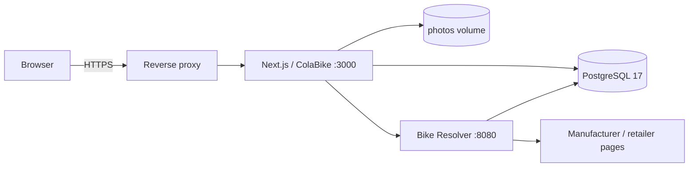

<div align="center">

# ColaBike

**Публичная витрина велосипедов и личный кабинет для тех, кто любит собирать, настраивать и показывать свой байк.**

[](./package.json)
[](https://nextjs.org/)
[](https://react.dev/)
[](https://www.postgresql.org/)
[](https://docs.docker.com/compose/)

[](https://github.com/grayhex/cola/actions/workflows/check.yml)
[](https://github.com/grayhex/cola/actions/workflows/deploy.yml)

</div>

ColaBike — это не просто «мой гараж». Главная страница работает как общая **выставка публичных велосипедов**: гости могут смотреть сборки, искать велосипеды, фильтровать их по типу и видеть рейтинг, заполненность и лайки. Владелец управляет своими велосипедами и персональным оформлением через отдельный **личный кабинет**.

> Публичность всегда управляется владельцем. Приватные велосипеды не попадают в витрину, их фотографии и карточки недоступны посторонним.

---

## Что уже умеет ColaBike

### Публичная витрина

- общая лента публичных велосипедов всех незаблокированных пользователей;
- доступ без регистрации;
- поиск по велосипеду и автору;
- фильтрация по типу велосипеда;
- постраничная выдача по 24 велосипеда;
- отдельная публичная карточка `/b/<uuid>`;
- ник автора рядом с велосипедом;
- лайки чужих публичных велосипедов для зарегистрированных пользователей;
- настраиваемая **прокаченность 0–100**;
- индикатор **заполненности карточки** по фотографиям и комплектации.

### Личный кабинет

Маршрут `/account` отделён от публичной витрины и предназначен для управления своими данными:

- список собственных велосипедов;
- создание, редактирование и удаление;
- публикация / снятие с публикации;
- изменение ника;
- персональная тема: светлая, тёмная или системная;
- персональный шрифт;
- свой акцентный цвет;
- компактный, сбалансированный или подробный вид карточки;
- индивидуальная настройка отображения пробега.

Почта аккаунта видна только владельцу.

### Карточка велосипеда

Для каждого велосипеда можно хранить:

- марку, модель, комплектацию, год и тип;
- название, цвет, размер, вес и пробег;
- описание и ссылку на производителя;
- стоимость велосипеда;
- актуальную комплектацию;
- аксессуары;
- ссылки и цены отдельных компонентов;
- заводскую спецификацию отдельно от текущей сборки;
- до **12 фотографий** с выбором обложки.

Цены велосипеда, компонентов и аксессуаров публикуются независимо друг от друга. По умолчанию они скрыты и не отдаются в публичный JSON.

Фотографии JPEG / PNG / WebP до 10 МБ декодируются сервером, уменьшаются максимум до 2400 px, очищаются от EXIF и сохраняются как WebP.

### Мастер добавления велосипеда

Новый велосипед создаётся в четырёх шагах:

1. **Идентификация** — тип, бренд, модель, год и версия комплектации.
2. **Поиск заводской сборки** — автоматический Bike Resolver, повторный поиск или импорт по URL.
3. **Комплектация** — проверка и редактирование найденных деталей либо ручное заполнение.
4. **Фото и параметры** — поиск фотографий, загрузка своих снимков, цвет, размер, цена, вес, пробег, описание и публичность.

До финального подтверждения запись велосипеда не создаётся. Сохранение велосипеда и компонентов выполняется транзакционно, а результат автоматического поиска берётся только из серверного preview, привязанного к пользователю.

### Bike Resolver

`services/bike-resolver` — отдельный внутренний сервис для поиска заводской комплектации и фотографий.

```text
ColaBike → Bike Resolver → официальный каталог / публичная товарная страница
```

Сейчас по умолчанию включены адаптеры:

- Specialized;
- Canyon;
- Giant.

Ещё семь адаптеров присутствуют, но отключены по умолчанию из-за недоступности источников или недостаточно надёжного определения модельного года. Их состояние и ограничения отображаются в админке.

Resolver умеет:

- искать точную заводскую спецификацию;
- отличать `resolved`, `ambiguous`, `not_found` и ошибки upstream;
- импортировать данные из публичной товарной страницы по URL;
- не перезаписывать уже существующую пользовательскую комплектацию;
- искать фотографии товара и отдавать временные безопасные кандидаты;
- кешировать результаты в PostgreSQL;
- ограничивать частоту запросов;
- блокировать локальные / служебные сети и проверять redirect/DNS для защиты от SSRF.

Подробности: [`services/bike-resolver/README.md`](services/bike-resolver/README.md).

### Админка

`/admin` доступна пользователям с ролью `admin`.

Основные разделы:

| Раздел | Возможности |
| --- | --- |
| **Обзор** | название сайта, регистрация, демонстрационный велосипед |
| **Оценка велосипедов** | база по типам, правила по компонентам, весу и цене, параметры заполненности |
| **Bike Resolver** | адаптеры, автопоиск, TTL, таймауты, интервалы, blocked domains, очистка кеша |
| **Оформление** | тема, шрифт, акцент, скругления, логотип, favicon, изображения категорий |
| **Блоки карточки** | порядок, видимость и варианты отображения содержимого |
| **Группы деталей** | группировка, иконки и порядок компонентов |
| **Тексты** | редактирование интерфейсных текстов без правки кода |
| **Справочники** | марки, модели, производители, категории и модели компонентов |
| **Пользователи** | роли, блокировка, завершение сессий, редактирование и удаление |
| **Медиа** | изображения сайта с серверной обработкой |
| **Журнал** | последние административные действия |

Оценка велосипеда — настраиваемая механика сообщества, а не техническая экспертиза совместимости. Аксессуары в неё не входят; скрытая стоимость также не влияет на публичный score.

---

## Архитектура



Bike Resolver не публикует порт `8080` наружу: в Compose он доступен только внутри сети проекта. Его internal API не должен проксироваться в интернет.

### Стек

| Слой | Технологии |
| --- | --- |
| Web | Next.js 16, React 19, App Router |
| API | Next.js route handlers, Node.js 22 |
| Database | PostgreSQL 17 |
| Validation | Zod |
| Images | Sharp |
| UI icons | Lucide React + собственные SVG-иконки компонентов |
| Resolver | Node.js / TypeScript / Fastify / PostgreSQL |
| Containers | Docker Compose |
| CI/CD | GitHub Actions + self-hosted production runner |

---

## Быстрый локальный запуск

Нужны Docker Engine / Docker Desktop и Docker Compose.

```bash
git clone https://github.com/grayhex/cola.git
cd cola
docker compose up --build -d
```

Откройте:

```text
http://localhost:3000
```

Проверить состояние контейнеров и логи:

```bash
docker compose ps
docker compose logs -f app
docker compose logs -f bike-resolver
```

Миграции основной БД выполняются автоматически перед запуском приложения. Resolver мигрирует свою схему при собственном старте.

Остановить проект:

```bash
docker compose down
```

Обычный `docker compose down` **не удаляет данные**. PostgreSQL и пользовательские фотографии находятся в именованных volumes `database` и `photos`.

> Не используйте `docker compose down -v`, если данные нужно сохранить.

---

## Конфигурация

Для Docker Compose `.env` необязателен при локальном запуске, но рекомендуется для любой постоянной установки.

```bash
cp .env.example .env
```

Основные переменные:

| Переменная | Назначение |
| --- | --- |
| `POSTGRES_PASSWORD` | пароль PostgreSQL |
| `APP_ORIGIN` | точный внешний origin без завершающего `/` |
| `COOKIE_SECURE` | `true` для HTTPS |
| `DATABASE_URL` | используется при локальном запуске Node вне Compose |
| `UPLOAD_DIR` | каталог фото при запуске вне Compose |
| `BIKE_RESOLVER_URL` | адрес resolver при запуске вне Compose |

Для production минимум:

```dotenv
POSTGRES_PASSWORD=use-a-long-url-safe-random-password
APP_ORIGIN=https://bike.example.com
COOKIE_SECURE=true
```

В Compose `DATABASE_URL`, `UPLOAD_DIR` и внутренний адрес Bike Resolver уже задаются контейнеру автоматически.

Если сайт открывается с другого устройства по HTTP в локальной сети, `APP_ORIGIN` должен точно совпадать с адресом в браузере, например:

```dotenv
APP_ORIGIN=http://192.168.1.20:3000
COOKIE_SECURE=false
```

---

# Production deployment

Текущий production deployment рассчитан на **Docker Compose + self-hosted GitHub Actions runner**.

Push в `main` запускает `.github/workflows/deploy.yml`, а runner выполняет:

```bash
sudo -n /usr/local/sbin/deploy-cola
```

## 1. Рабочая копия на сервере

Production-копия репозитория находится в:

```text
/opt/stacks/cola
```

Если сервер разворачивается с нуля, создайте рабочую копию в этом каталоге выбранным способом аутентификации GitHub — например SSH deploy key или уже настроенные credentials:

```bash
sudo mkdir -p /opt/stacks
sudo git clone git@github.com:grayhex/cola.git /opt/stacks/cola
cd /opt/stacks/cola
```

Этот раздел описывает существующую staging VM. Для публичного VDS используйте отдельный [production runbook](docs/OPERATIONS.md#migration-from-staging-vm-to-production-vds) и `compose.prod.yaml`. На staging **до первого запуска БД** задайте постоянный `POSTGRES_PASSWORD`.

```bash
sudo nano /opt/stacks/cola/.env
```

Пример:

```dotenv
POSTGRES_PASSWORD=replace-with-a-long-random-password
APP_ORIGIN=https://bike.example.com
COOKIE_SECURE=true
```

Первый запуск:

```bash
cd /opt/stacks/cola
sudo docker compose up -d --build --remove-orphans --wait --wait-timeout 120
sudo docker compose ps
```

## 2. Deploy script

Скрипт теперь хранится в `ops/deploy-cola`. Он выкатывает точный проверенный
commit, переданный CI, а не новый непроверенный HEAD main. Перед первым deploy
после обновления установите его на VM:

```bash
sudo install -o root -g root -m 755 ops/deploy-cola /usr/local/sbin/deploy-cola
```

Обычный вызов без аргумента повторно выкатывает последний успешно проверенный
commit. Для нового main используйте автоматический pipeline или ручной запуск
workflow. Полная инструкция: [Beta operations](docs/OPERATIONS.md).

## 3. Sudo для GitHub runner

Runner работает от пользователя `github-runner`. Ему разрешён безпарольный запуск только deploy-скрипта.

Создайте отдельное правило:

```bash
sudo visudo -f /etc/sudoers.d/cola-deploy
```

Содержимое:

```text
github-runner ALL=(root) NOPASSWD: /usr/local/sbin/deploy-cola
```

Проверка:

```bash
sudo visudo -cf /etc/sudoers.d/cola-deploy
```

## 4. Self-hosted runner

Workflow ожидает runner с label `self-hosted`.

На текущем сервере systemd-service называется:

```text
actions.runner.grayhex-cola.docker.service
```

Проверить его:

```bash
systemctl status actions.runner.grayhex-cola.docker.service
```

После push/merge в `main` GitHub Actions автоматически вызывает deploy-скрипт. Workflow использует `concurrency: cola-production`, поэтому production-деплои не выполняются параллельно.

## 5. Reverse proxy и HTTPS

Перед `:3000` должен стоять reverse proxy с HTTPS.

Рекомендуемые требования:

- внешний адрес должен совпадать с `APP_ORIGIN`;
- для HTTPS обязательно `COOKIE_SECURE=true`;
- разрешённый размер request body — не меньше **11 МБ**;
- порт Bike Resolver `8080` нельзя публиковать наружу;
- `/internal/*` resolver нельзя отдавать через reverse proxy;
- доступ к `:3000` желательно ограничить firewall'ом или сетью reverse proxy.

## 6. Первый администратор

Сначала зарегистрируйте обычный аккаунт через сайт, затем назначьте ему роль администратора.

**Команду нужно запускать из каталога проекта**, а не из `/home/github-runner/actions-runner`:

```bash
cd /opt/stacks/cola
docker compose exec app node scripts/set-admin.js you@example.com
```

Эквивалентный вариант из любого каталога:

```bash
docker compose -f /opt/stacks/cola/compose.yaml \
  --env-file /opt/stacks/cola/.env \
  exec app node scripts/set-admin.js you@example.com
```

Скрипт не создаёт аккаунт и пароль — он только назначает роль `admin` уже существующему пользователю.

---

## Обновление без GitHub Actions

Для ручного обновления production используйте тот же deploy-скрипт:

```bash
sudo /usr/local/sbin/deploy-cola
```

Для обычной локальной установки достаточно:

```bash
git pull --ff-only
docker compose up -d --build --remove-orphans --wait
```

Миграции применятся автоматически.

---

## Резервное копирование

Сохранять нужно **оба типа данных одновременно**:

1. PostgreSQL;
2. volume `photos`.

Пример дампа БД:

```bash
cd /opt/stacks/cola
docker compose exec -T db \
  pg_dump -U colabike -d colabike -Fc > colabike-$(date +%F).dump
```

Фотографии находятся в Docker volume `photos`. Их резервную копию следует делать вместе с дампом БД, поскольку записи фотографий и файлы должны соответствовать друг другу.

Смена `POSTGRES_PASSWORD` в `.env` **не меняет пароль внутри уже созданного PostgreSQL volume**.

---

## Разработка без Docker

Требования:

- Node.js 22+;
- pnpm 11.19.0;
- доступный PostgreSQL.

```bash
corepack enable
corepack prepare pnpm@11.19.0 --activate
pnpm install --frozen-lockfile
pnpm test
pnpm build
pnpm dev
```

Для локального Next.js удобно использовать `.env.local`.

Миграции вручную:

```bash
node --env-file=.env.local scripts/migrate.js
```

Или через package script, если окружение уже экспортировано:

```bash
pnpm db:migrate
```

### Bike Resolver

```bash
cd services/bike-resolver
npm ci
npm run typecheck
npm test
npm run build
```

Полная интеграционная проверка из корня проекта:

```bash
pnpm test:integration
```

Она использует временное тестовое окружение и не должна направляться на production-базу.

---

## CI

Pull request запускает `.github/workflows/check.yml`:

```text
pnpm install
  → pnpm test
  → pnpm build
  → resolver npm test + npm run build
  → pnpm test:integration
```

Deploy на self-hosted runner выполняется после успешного `check` того же commit через `needs`. CI также проверяет Chromium, mobile WebKit, Compose и восстановление backup. Ручной workflow повторяет проверки перед deploy.

---

## Безопасность

В проекте уже реализованы:

- scrypt для паролей;
- случайные сессии, которые хранятся в БД в виде SHA-256 digest;
- `HttpOnly` / `SameSite` cookies;
- `Secure` cookies в production;
- PostgreSQL-backed rate limits для auth, resolver, photo search и лайков;
- проверка `Origin` для изменяющих запросов;
- серверная Zod-валидация;
- параметризованные SQL-запросы;
- изоляция данных владельцев;
- отзыв публичной ссылки с ротацией UUID;
- запрет чтения приватных фотографий посторонними;
- re-encode пользовательских изображений вместо хранения исходного файла;
- SSRF-защита Bike Resolver.

При снятии публикации публичный URL перестаёт работать. Старый UUID не становится активным снова после повторной публикации.

---

## Ограничения текущей версии

- подтверждение email ещё не реализовано;
- восстановление пароля по email ещё не реализовано;
- OAuth нет;
- пользовательские фото хранятся локально в Docker volume, S3/object storage пока нет;
- live-доступность каталогов производителей зависит от региона, даты и антибот-защиты;
- CUBE и несколько других адаптеров присутствуют в resolver, но сейчас отключены по умолчанию из-за ненадёжного live-разрешения.

---

## Структура репозитория

```text
app/                    Next.js UI и API
lib/                    доменная логика приложения
 db/                    SQL-миграции основной БД
public/                 статические ресурсы
scripts/                миграции, admin/helper scripts, интеграционные runner'ы
services/
  bike-resolver/        отдельный сервис поиска спецификаций и фото
.github/workflows/      CI и production deploy
compose.yaml            app + PostgreSQL + Bike Resolver
Dockerfile              production image ColaBike
```

---

<div align="center">

**ColaBike** — собери байк, покажи сборку, сравнивай идеи и продолжай прокачивать велосипед.

</div>

## Подготовка публичной beta

[Эксплуатация, квоты, backup/restore и переезд на colabike.ru](docs/OPERATIONS.md).
[Аудит безопасности и оставшиеся ограничения](docs/BETA_AUDIT.md).

## Social Core: владельцы коллекций

У каждого участника есть публичная страница `/u/<username>`: имя, аватар,
описание, местоположение (необязательно), дата регистрации, счётчики и коллекция
**только публичных** велосипедов. Ссылка на автора есть на витрине и в публичной
карточке велосипеда. Пустое поле `badges` зарезервировано под будущие достижения.

Username меняется в «Личный кабинет → Мой профиль»: 3–30 латинских строчных
символов, цифры, `.`, `_`, `-`. Ввод нормализуется без учёта регистра; системные
имена зарезервированы. Миграция `009_social_core.sql` выдаёт существующим аккаунтам
`rider-xxxxxxxx` с безопасным суффиксом при совпадении UUID-префикса. Новые аккаунты
получают случайный username и могут выбрать свой. Старый URL после смены имени
перестаёт работать: история имён и перенаправления пока не предусмотрены.
Отображаемое имя остаётся Unicode и не обязано совпадать с username.

Подписка односторонняя; взаимные подписки отображаются как **Друзья**. Списки
подписчиков, подписок и друзей доступны постранично (20 человек). Подписаться на
себя нельзя. Повторные PUT/DELETE идемпотентны. Заблокированные пользователи
исключаются из профилей, списков, счётчиков, аватаров и публичной витрины.

Новый `/account` разделён на основные экраны (и раздел «Достижения»):

- **Обзор**: профиль, публичные/приватные байки, социальные счётчики, сумма лайков
  публичных велосипедов и последние велосипеды.
- **Мой профиль**: username, имя, bio, location и загрузка/удаление аватара.
- **Мои велосипеды**: существующий мастер, редактирование, фото и публикация.
- **Социальное**: подписки, подписчики и друзья.
- **Оформление**: личная тема, шрифт, акцент, компоновка и отображение пробега.
- **Аккаунт**: приватный email, дата регистрации и выход. Админка остаётся отдельно.

### Social API

| Метод | URL | Назначение |
| --- | --- | --- |
| GET | `/api/social/profiles/:username` | Публичный профиль и отношения с текущим пользователем |
| GET | `/api/social/profiles/:username/bikes?page=1` | Публичные велосипеды (24 на страницу) |
| GET | `/api/social/profiles/:username/followers?page=1` | Подписчики |
| GET | `/api/social/profiles/:username/following?page=1` | Подписки |
| GET | `/api/social/profiles/:username/friends?page=1` | Взаимные подписки |
| PUT / DELETE | `/api/social/profiles/:username/follow` | Подписаться / отписаться |
| GET | `/api/social/account` | Приватный обзор владельца |
| PATCH | `/api/social/me` | `{username,name,bio,location}` (все четыре поля) |
| PATCH | `/api/social/preferences` | `{preferences}` из существующего allowlist |
| PUT / DELETE | `/api/social/me/avatar` | Raw JPEG/PNG/WebP / удаление своего аватара |
| GET | `/api/avatars/:id` | Только действующий аватар незаблокированного владельца |

Public-author DTO велосипеда теперь объект `{id,username,name,avatar}` вместо
текстового имени. Публичные DTO строятся по allowlist: email, preferences, role,
blocked, password/session данные и пути файлов не передаются. Изменения требуют
сессии и существующей проверки Origin. Лимиты на 15 минут: 60 действий подписки,
30 изменений профиля/настроек, 15 замен/удалений аватара.

Аватар загружается только файлом до 2 МиБ, с проверкой сигнатуры и лимитом
40 мегапикселей при декодировании. Sharp удаляет EXIF и формирует квадратный WebP
512×512. Произвольные URL не принимаются. Единственный аватар входит в общую
квоту дискового места пользователя; успешная замена удаляет прежний файл.
Хранение — существующий photos/uploads volume, охватываемый backup/restore.

### Проверка Social Core

`pnpm test` проверяет миграцию, ограничения, DTO, граф, приватность и обработку
аватаров; `pnpm test:integration` — API, Origin, владение, блокировку и rate limit.
`pnpm test:e2e` запускает существующие и новые сценарии Chromium и mobile WebKit:
редактирование кабинета, аватар, коллекция, переход велосипед → автор → подписка
→ друзья. В CI также остаются production build, resolver tests, PostgreSQL 17,
Compose и отдельный backup/restore drill с аватаром.

Ручная приёмка: создайте два аккаунта, заполните профиль первого, загрузите аватар
и опубликуйте один из двух велосипедов. Из второго откройте его велосипед,
перейдите к автору и подпишитесь. Подпишитесь в ответ из первого — появятся
«Друзья». Проверьте, что приватный велосипед и email не видны гостю; смените
username и аватар; заблокируйте аккаунт через админку и проверьте исчезновение
его профиля, аватара и социальных связей из публичного представления.

## Обсуждения, уведомления и подписки

У публичного велосипеда теперь есть **обсуждение сборки**: комментарии до 1000
символов, один уровень ответов, редактирование и удаление своего текста. Текст
отображается как plain text, без Markdown и HTML. Удаление очищает тело и сохраняет
структуру ответов; недоступный основной комментарий становится нейтральной строкой
без имени автора. Ответы заблокированных авторов скрыты. Приватные велосипеды не
позволяют читать или писать комментарии даже по известному ID.

**Уведомления** (`/notifications`) показывают подписки, лайки, комментарии и ответы
с аватаром, профилем автора и ссылкой на актуальный велосипед/ветку обсуждения.
Свои действия не порождают уведомлений. Есть отметка одного/всех прочитанными,
постраничный список и счётчик в общей шапке. Открытая страница обновляется раз в
30 секунд, только пока вкладка видима; фонового polling в шапке нет. Счётчик
ограничен `99+`, чтобы не считать весь журнал при каждой навигации.

Защита от спама: одно уведомление о подписке на пару пользователей и одно о лайке
на пару автор/велосипед за всё время. Снять/вернуть like или подписку не сбрасывает
прочтение и дату. Комментарии/ответы одного автора одному получателю на одном
велосипеде объединяются отдельно по типу события в 15-минутные окна PostgreSQL.
Уведомление ведёт к первому событию окна; новое прочтение не сбрасывается. Если
владелец велосипеда одновременно автор основного комментария, ему приходит только
уведомление об ответе, без дублирующего уведомления о комментарии.

**Подписки** (`/feed`) — хронологическая лента публичных велосипедов владельцев,
на которых подписан текущий пользователь. Включает их существующую коллекцию,
новые байки и публикацию ранее приватных. Сортировка по `published_at`; обычное
редактирование не поднимает карточку. Повторная публикация поднимает ту же карточку,
не создавая дубликат. Общая `/` остаётся публичной витриной. «Рекорды» в навигации
пока обозначены как будущий раздел; личных сообщений/DM нет.

В меню комментария, публичного профиля и блока обсуждения велосипеда есть
**«Пожаловаться»**. Причины: спам, оскорбления, недопустимый контент, авторские права,
другое. Повторная жалоба того же пользователя на тот же объект не создаёт новую
запись, в том числе после закрытия. В админке раздел «Жалобы» позволяет открыть
объект, перейти к управлению пользователем, закрыть жалобу или удалить комментарий.
Модерация записывается в существующий audit log.

### Community API

Все новые маршруты находятся под `/api/community`; изменения требуют сессии и
того же Origin. Read endpoints комментариев публичны только для публичного байка.

| Метод | Маршрут | Назначение |
| --- | --- | --- |
| GET / POST | `/bikes/:id/comments` | Основные комментарии / новый комментарий `{body,parentId?}` |
| GET | `/bikes/:id/comments/:parentId/replies?page=1` | Ответы на основной комментарий |
| PATCH / DELETE | `/comments/:id` | Изменить `{body}` / soft delete (владелец или admin для удаления) |
| GET | `/notifications`, `/notifications/count` | Личный список / ограниченный unread counter |
| PATCH | `/notifications/:id/read`, `/notifications/read-all` | Отметка прочтения |
| GET | `/feed?page=1` | Лента подписок, 24 велосипеда |
| POST | `/reports` | `{entityType,targetId,reason}` |
| GET | `/admin/reports?status=open&page=1` | Очередь модерации, только admin |
| PATCH | `/admin/reports/:id` | `{action: "close" \| "delete_comment"}`, только admin |

Списки комментариев, ответов, уведомлений и жалоб возвращают `page`/`hasMore`, по
20 записей. Основные комментарии включают первые три ответа и `replyCount`;
ответы загружаются отдельно по запросу. `?focus=<comment UUID>` выбирает конкретную
ветку для перехода из уведомления. В bike social DTO добавлено число `comments`.
Лимиты на 15 минут: 20 новых комментариев, 40 изменений/удалений, 10 жалоб,
120 отметок прочтения. Existing limits, quotas, private DTO boundaries и Origin
checks не ослаблены.

### Проверка общения

Миграция `010_community.sql` добавляет комментарии, notifications, reports и дату
публикации с trigger, охватывающим существующие пути создания/публикации. Лента
переиспользует public bike DTO и семь bulk SQL-запросов витрины (включая награды). Чтение обсуждения
занимает три запроса независимо от числа корневых комментариев на странице;
переход к конкретному комментарию — четыре. Ограниченные previews не загружают
всю ветку. Уведомления не хранят HTML, имена велосипедов или произвольные ссылки:
DTO и адреса строятся из текущих доступных сущностей.

`pnpm test` и `pnpm test:integration` проверяют права, soft delete, nesting,
блокировки, dedup, прочтение, публикацию в feed, жалобы и модерацию. Browser E2E
в Chromium и mobile WebKit проверяет двух пользователей: подписка → like →
комментарий → уведомление владельцу → ответ → уведомление автору → новый байк в
feed. Отдельно проверяется отображение XSS-строки как текста и mobile overflow.

## Hall of Fame: достижения, рекорды и голос сообщества

ColaBike — публичная витрина сборок с владельцами, обсуждениями и соревнованием
за объяснимые звания. `/records` показывает текущих лидеров с фото, владельцем,
значением и временем расчёта. Главная сохраняет общую витрину и добавляет режимы
«Новые», «Популярные», «Рекордсмены». Профиль и велосипед получили полки наград,
а `/account?tab=achievements` — заработанные награды и следующие цели.

Три разных механики:

- **Достижение** — запись в истории. Первый публичный велосипед, полная сборка,
  10/50/100 лайков велосипеда, 100 лайков владельца, 10/50 подписчиков, три
  категории в публичной коллекции, обсуждение 20 разных чужих публичных байков.
  Порог считается в момент события; последующее снижение счётчика не отбирает награду.
- **Рекорд** — текущий лидер, а не постоянная награда: цена, бюджет, минимальный
  вес отдельно MTB/gravel/road, лайки, прокаченность, заполненность.
- **Звание сообщества** — лидер дополнительных реакций: «Безумие», «Чистая
  сборка», «Хочу такой». «Выбор сообщества» считает уникальных людей, поставивших
  хотя бы одну такую реакцию. Обычный Like остаётся отдельным действием.

Определения централизованы в `lib/gamification-definitions.js`; API/настройки
валидируются Zod. Текущие рекорды никогда не сохраняются в `achievement_awards`.
Миграция `011_gamification` создаёт awards, reactions, отдельные настройки,
индексы и флаг исключения велосипеда. Никаких цен или снимков приватных данных
в awards нет. Существующие пользователи получают уже достигнутые milestones.
SQL-триггеры проверяют маленький фиксированный список условий при событиях
велосипеда, комплектации, фото, подписки, лайка и комментария. Проверки одного
владельца сериализованы advisory transaction lock; уникальные индексы исключают
повторное награждение. Добавление нового определения не требует новой таблицы;
для нового автоматического условия нужна версия функции проверки.

### Правила участия и privacy

Все рекорды: публичный велосипед, незаблокированный владелец, отсутствие
исключения администратором и минимальная заполненность (по умолчанию 50%).
Заполненность и upgrade используют существующий `scoreBike`, включая справочник
групп и администраторские правила. Цена скрытого велосипеда исключается **в SQL**
до передачи кандидатов функции ранжирования; скрытая цена не влияет на upgrade.

- Цена: только `show_bike_price=true`, положительное значение.
- Budget Hero: цена **строго выше** 5 000 ₽ по умолчанию, реальное фото,
  производитель, модель и год. Цена 1 не участвует.
- Вес: явный диапазон 3–50 кг по умолчанию, отдельный лидер каждой категории.
- Реакции и лайки: только незаблокированные участники; собственный голос исключён.
- При равенстве используется стабильный UUID велосипеда (возрастание).

Текущий UX предполагает рубли. Настройка валюты площадки явно зафиксирована как
`currency: RUB` (другие значения отклоняются); FX и сравнения разных валют нет.
Админ → «Награды и рекорды»: включение каждого рекорда и реакций, пороги цены,
веса и заполненности; исключение/возврат конкретного байка с причиной и аудитом.
Исключение не снимает публикацию и не стирает историю достижений.

Публичная полка не показывает bike-specific награды приватного велосипеда.
В кабинете владелец видит их историю. Общие user milestones сохраняют только факт
ранее достигнутого публичного порога. Заблокированный владелец исчезает со всех
публичных полок. После удаления байка его awards удаляются каскадно; общие награды
пользователя остаются. Уведомлений о наградах в этой версии нет.

### API

- `GET /api/game/records` — текущие лидеры, правила и `asOf`.
- `GET /api/game/profiles/:username`, `GET /api/game/bikes/:id` — безопасные полки.
- `GET /api/game/me` — личные награды, locked/progress и текущие рекорды.
- `GET /api/game/bikes/:id/reactions`, `PUT|DELETE .../reactions/:kind` — реакции.
  PUT/DELETE идемпотентны, максимум 60 изменений за 15 минут на пользователя.
- `GET|PUT /api/game/admin/settings` — правила, только admin.
- `GET /api/game/admin/bikes?page=N`, `PATCH .../bikes/:id` с
  `{excluded, reason}` — очередь участия/аудируемое исключение.
- `GET /api/showcase?sort=new|popular|records` — режимы витрины.

Мутации сохраняют origin/CSRF semantics, авторизацию и ограничение тела запроса.
Публичные responses используют explicit DTO; email, role, preferences и причины
модерации не публикуются. Реакции не генерируют уведомления и не создают spam loop.

### Производительность и проверка

Обычная витрина и feed — **7 фиксированных запросов на непустую страницу**:
к прежним шести добавлен один bulk-запрос наград для всех 24 карточек. На карточке
максимум два badge; запросов на каждый badge нет. Режим рекордсменов дополнительно
получает IDs актуальных лидеров.

Hall of Fame / полка детальной страницы: один агрегирующий SQL snapshot всех
публичных eligible-кандидатов плюс настройки. Компоненты, фото, лайки и реакции
агрегируются по отношениям, а не N+1. Затем общий JS scorer применяется один раз
к каждому кандидату, и выбираются лидеры. Это сохраняет единую формулу upgrade,
включая пользовательские правила администратора. Нет TTL-кеша: privacy и смена
лидера действуют со следующего запроса, без устаревших публичных значений.
Сканирование кандидатов выполняется на странице рекордов/детальной полке,
**не на каждой карточке витрины**. Это сознательное ограничение первой версии.

`node scripts/explain-records.js` воспроизводит EXPLAIN ANALYZE в изолированном
PostgreSQL/PGlite: 500 владельцев, 2 000 байков, 42 000 компонентов, 20 000 лайков.
План агрегирует отношения один раз (hash joins / group aggregate); результат
1 800 публичных кандидатов. Локальный ориентир: SQL 248 мс, отдельный полный запрос
с передачей JSON 300 мс, ранжирование 38 мс. Это не production SLA. На существенно
большей площадке следующим шагом будет транзакционный кэш метрик с обязательной
проверкой актуальной публичности; отдельный сервис/worker не требуется сейчас.

Тесты: `tests/gamification.test.js`, `tests/gamification-http.js`,
`tests/e2e/gamification.spec.js`. Браузерный сценарий двух владельцев проверяет
смену и возврат рекорда, полку профиля, кабинет, реакции и мобильную ширину
в Chromium и WebKit. Основные команды и существующий CI остаются прежними.
