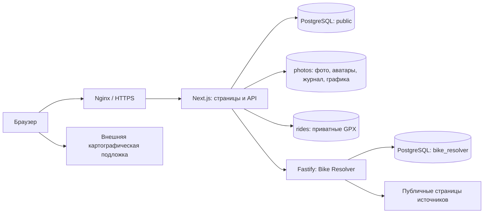

# Архитектура приложения

[Оглавление](../README.md)

## Модель системы

ColaBike — приложение вокруг велосипеда как постоянного объекта: его владелец ведёт комплектацию, публикует записи и покатушки, а другие участники подписываются и обсуждают их. Главная остаётся витриной велосипедов. Журнал, поездки, поиск и рекорды используют эти же сущности и права, а не независимые копии профилей и байков.

В runtime три Compose-сервиса: `app`, `db`, `bike-resolver`. Nginx установлен на хосте и не входит в Compose. База физически общая, но доменные таблицы приложения и схема `bike_resolver` имеют разных владельцев логики. Отдельного Redis, брокера очередей или Elasticsearch нет. Файловые очереди удаления обслуживаются существующим cleanup-скриптом.

Основной код — JavaScript/React, Resolver — TypeScript/Fastify. Версии зависимостей смотрите в [package.json](../../package.json), [package.json Resolver](../../services/bike-resolver/package.json) и lock-файлах; Docker-образы в [Dockerfile](../../Dockerfile) и [Compose](../../compose.prod.yaml). Не путайте Node приложения с runtime, на котором выполняется Marketplace action в CI.

## Карта кода

| Область | Ответственность |
| --- | --- |
| `app/**/page.jsx`, `app/layout.jsx` | Маршруты Next, общий layout, начальные настройки |
| `app/ui/` | Клиентские компоненты, запросы, локальный черновик и состояния интерфейса |
| `app/api/` | HTTP, авторизация, Origin, лимиты, входные схемы, вызов доменных функций |
| `lib/` | SQL и доменная логика, DTO, валидация, файлы, настройки, клиент Resolver |
| `db/` | Миграции приложения и одноразовый серверный demo importer |
| `services/bike-resolver/` | Независимый HTTP-сервис, discovery, парсинг, cache, собственные миграции |
| `scripts/`, `ops/` | Сборка, миграции, проверки runtime, backup и deploy wrappers |
| `tests/` | Unit/DB, HTTP и браузерные сценарии приложения |

## Типовой запрос

Запрос изменения проходит через обработчик `app/api/.../route.js`: проверяется текущий пользователь, Origin и входная схема, затем доменная функция выполняет SQL/файловую операцию. Возвращается предназначенный этой аудитории DTO. UI обновляет состояние по результату; скрытая кнопка не заменяет серверное разрешение.

[lib/db.js](../../lib/db.js) предоставляет `db` и `transaction`. Доменные функции, принимающие `q`, могут работать как с пулом, так и внутри транзакции. Это позволяет проверять правила на тестовой базе и сохранять согласованность нескольких изменений. Не открывайте независимую транзакцию из функции, которая должна участвовать в транзакции вызывающего кода.

[SiteProvider](../../app/ui/site-provider.jsx) объединяет серверные настройки сайта и личные предпочтения. Настройки отображения публичны. Секреты подключения к БД и внутреннему сервису сюда не попадают.

## Граница парсера

Браузер не обращается к Resolver напрямую. Запрос идёт через [bike-resolver-client.js](../../lib/bike-resolver-client.js) и [resolver-proxy.js](../../lib/resolver-proxy.js). Resolver возвращает результат с происхождением данных, но не создаёт пользователя, велосипед или установленные компоненты. Приложение выдаёт preview владельцу и сохраняет выбранный результат через собственные правила.

Недоступность Resolver ухудшает автозаполнение, но не должна блокировать ручное создание/редактирование. Подложка карты аналогично не является источником GPX-метрик: её отказ оставляет маршрут и данные поездки.

## Границы масштабирования

Текущая установка рассчитана на один Resolver: часть discovery, photo IDs и диагностики живёт в памяти процесса. Списки используют bulk-загрузку и SQL-пагинацию; рейтинг и нормализация поиска могут стать дорогими при росте базы. Сначала измерьте запросы, затем меняйте индексы/кэш. Любая оптимизация обязана сохранить динамическую приватность.

Далее: [данные](data-model.md), [безопасность](security.md), [разработка](../development/principles.md).
