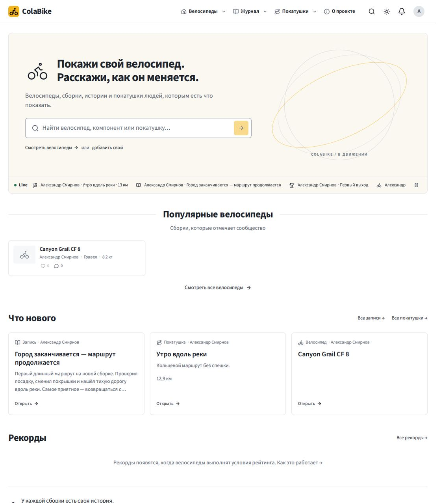
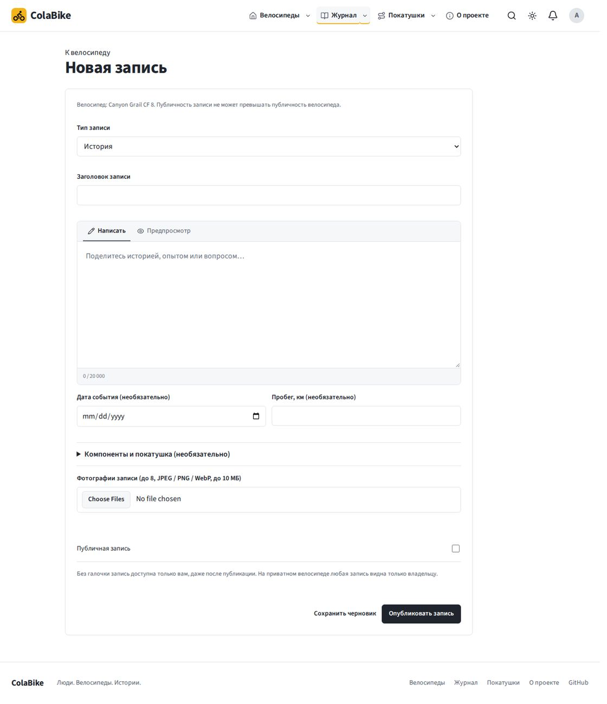
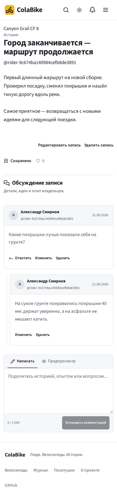
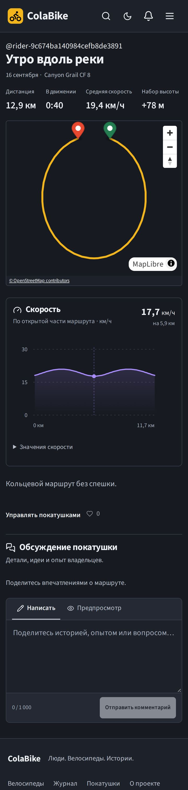
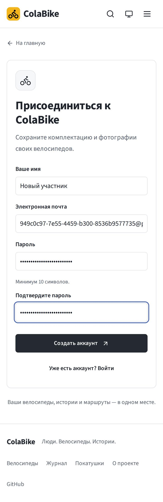
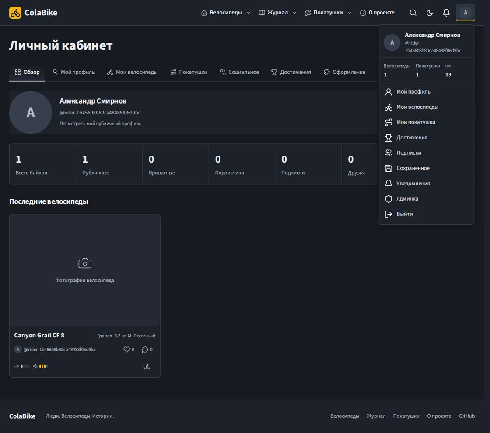
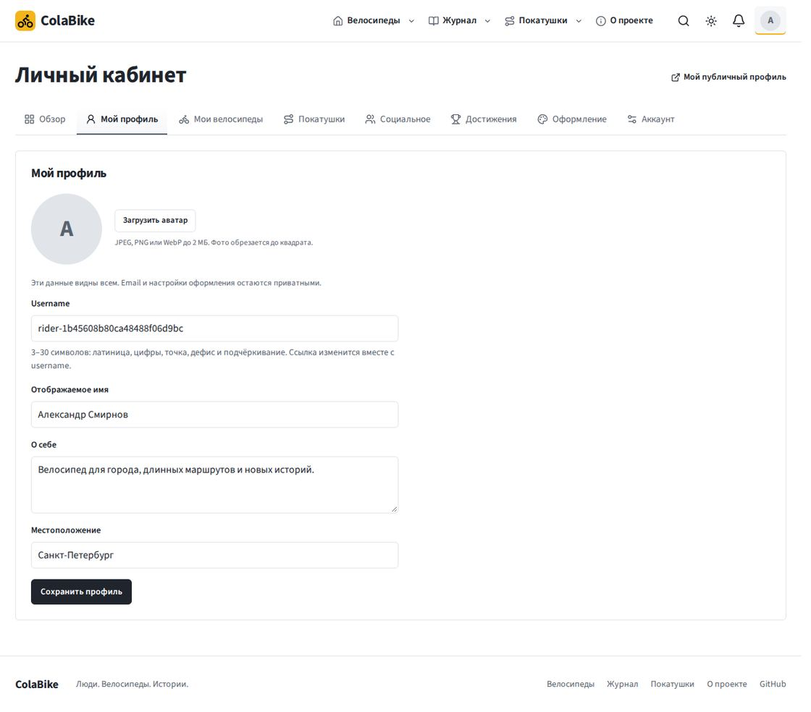

# Второй этап интерфейса ColaBike

## Задача и референсы

Завершить общий UI всех страниц, убрать прежний конструктор оформления и исправить падения [CI 35602385147](https://github.com/grayhex/cola/actions/runs/35602385147). Основа: `main` после PR #44, commit `23b311b9cb5143672303a5ca25168564d9036e01`.

Референсы просмотрены в браузере: [модель Hugging Face](https://huggingface.co/deepseek-ai/DeepSeek-V4.1-Flash), [Community](https://huggingface.co/deepseek-ai/DeepSeek-V4.1-Flash/discussions), ветка обсуждения и [Pirateface](https://pirateface.co/). Из них взяты принципы элементов и композиции, собственный контент не копировался.

| Референс | Реализация |
| --- | --- |
| Поле prompt и редактор обсуждения HF | Общий `PromptComposer`: поле, вкладки с иконками, безопасный предпросмотр, счётчик, действия |
| Вкладки и кнопки HF | Единые компактные вкладки с нижней границей, нейтральная primary-кнопка и вторичные действия |
| Community HF | Карточки комментариев с автором/датой, действиями и деревом ответов |
| График модели HF | Фиолетовая линия скорости с мягкой заливкой, осями, значением под указателем и доступной таблицей |
| Композиция Pirateface | Заголовок, велосипед и поиск слева; самостоятельная область под анимацию справа |

Правая область hero сейчас содержит статичную композицию. Самостоятельная анимация не создавалась: задача этого этапа — зарезервировать для неё место. На телефоне декоративная область скрывается.

## Что изменено

Общие кнопки, поля, типографика и вкладки применены к витрине, велосипеду, журналу, редактору, обсуждениям, покатушкам, профилю, кабинету, поиску, сохранённому, подпискам, уведомлениям, рекордам, странице проекта и админке. Добавлены самостоятельные `/login` и `/register`; гостевой кабинет использует ту же форму. Обновлены 404 и экран ошибки. Меню профиля использует общую палитру, иконки и компактные строки действий.

Удалены runtime/API импорта иконок, растровые подмены системных значков, старые фоновые баннеры, пресеты, каталог шрифтов и формы старого оформления. Остаётся Source Sans 3 и встроенная векторная графика. Изображения контента и наград по-прежнему редактируются через медиатеку.

Миграция `016_product_ui.sql` удаляет старые ключи из `site_settings` и персональные `font/accent/theme`, добавляет `rides.public_speed_profile`. Settings API имеет строгую схему и отклоняет удалённые поля. Старые файлы не удаляются автоматически: их можно очистить через медиатеку после проверки использования.

## Исправления CI

1. Chromium: сохранение записи меняло `aria-pressed` оптимистически до завершения PUT. Переход на `/saved` мог начаться до фиксации записи. Теперь подтверждённое состояние и callback появляются после ответа сервера; ожидание доступно через `aria-busy`. Браузерная регрессия задерживает запрос, проверяет неизменность подтверждённого состояния, затем переход и фактическое наличие записи.
2. Mobile WebKit: сообщение об успешном сохранении настроек появлялось до завершения `refreshAssets`, пока вкладки ещё были disabled. Теперь уведомление появляется после обновления медиатеки, вместе с разблокировкой управления. Существующая проверка клавиатурной навигации сохранена.

Правила CI и итоговый gate не ослаблялись. Тесты удалённых функций убраны вместе с их кодом; проверки сохранённых возможностей перенесены на текущую схему.

## Данные графика

Скорость вычисляется по интервалам GPX с временными отметками. Сначала применяется тот же фильтр приватности, что и к геометрии. DTO содержит только относительное расстояние по видимым сегментам и скорость, без координат и абсолютного времени. Отдельные треки, скрытые зоны, отсутствующие времена и недостоверные интервалы не соединяются линией. Число точек ограничено.

Профиль пересчитывается при сохранении и изменении приватности. У ранее сохранённых покатушек поле пустое до следующего сохранения; UI показывает объяснение, а не выдуманную кривую. Фоновый backfill исходных GPX не запускается.

## Проверка

- Production build: `pnpm build --webpack`.
- Application unit / PGlite: 112 тестов, все прошли.
- HTTP integration: все 12 наборов прошли, включая auth, административные settings, Resolver, журнал, покатушки и приватность. Локально использовался одноразовый PGlite; конкурентные проверки PostgreSQL остаются в штатном CI.
- Браузеры: 65 сценариев успешно проверены в полном прогоне и адресных повторах (Chromium desktop и эмуляция iPhone 13); один hover-сценарий штатно пропускается на touch-устройстве. Адресный повтор: 17/17 desktop и 17/17 mobile.
- Финальный проход всех страниц в обеих темах: 4/4 теста прошли. Проверены адаптивный размер графика, выбор значения, дерево ответов, формы и отсутствие переполнения/ошибок JavaScript.
- Mobile WebKit локально недоступен. Штатная CI-матрица Chromium / WebKit mobile сохранена без изменений.

Снимки сделаны в одноразовой тестовой БД. Фикстуры не публиковались на сайте. График использует синтетический GPX с настоящими временными интервалами; даты и записи на скриншотах — тестовые данные.

## Скриншоты

Главная: велосипед и заголовок слева, отдельная область справа.

Общий редактор записи.

Обсуждение и дерево ответов на телефоне.

Скорость на телефоне: подписи остаются читаемыми.

Регистрация.

Меню профиля в тёмной теме.

Настройки профиля.

